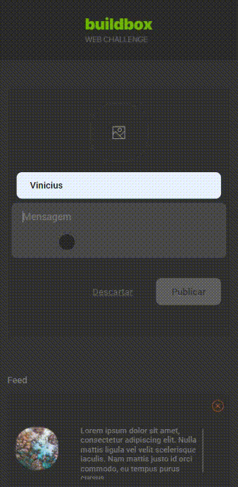

# Buildbox

## Funcionalidades:

### `Adicionar`
É possível adicionar posts.

### `Deletar`
Também é possível apagar um post

### `Atenção`
Só e possível adicionar um post que tenha image, nome e mensagem

## Desktop

## Mobile

## Tecnologias
### `HTML5`
### `CSS3`
### `JavaScript`
### `React JS`
### `Jest`
